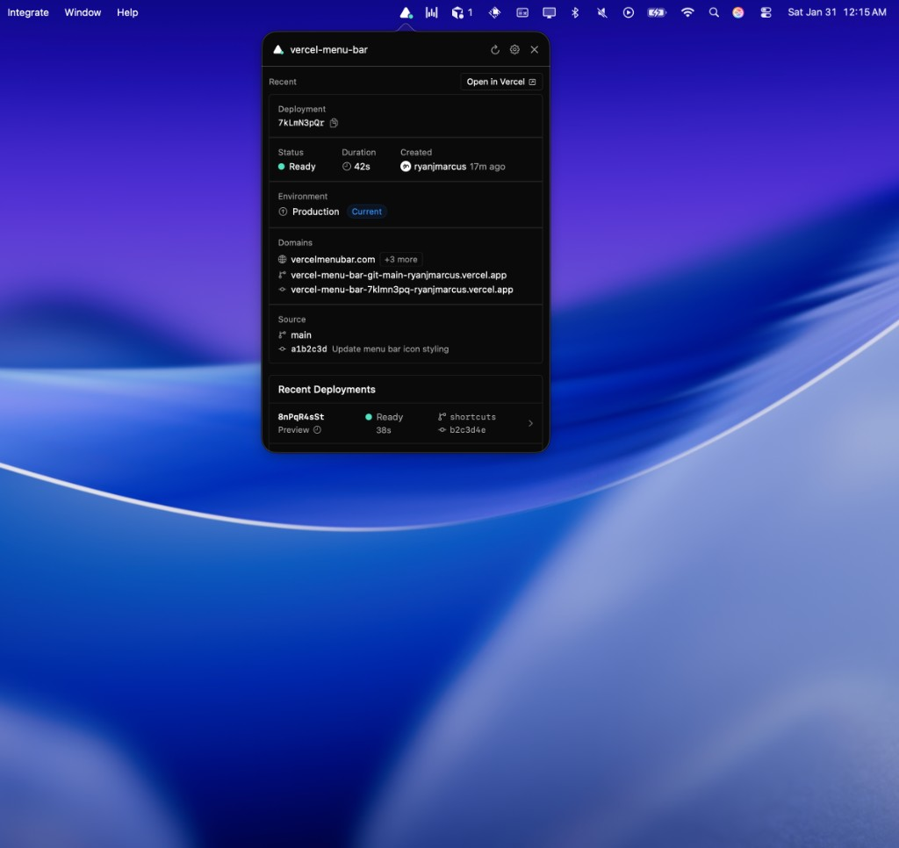
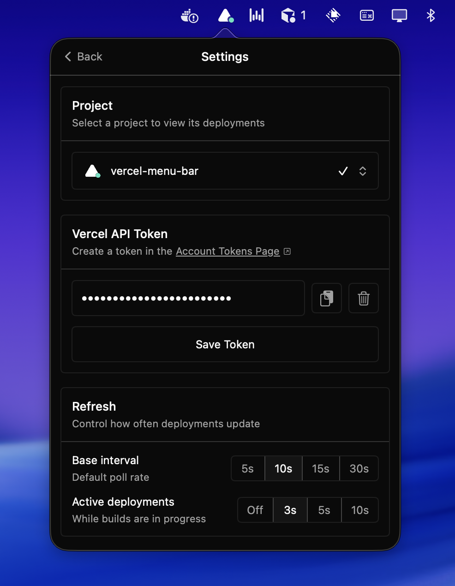
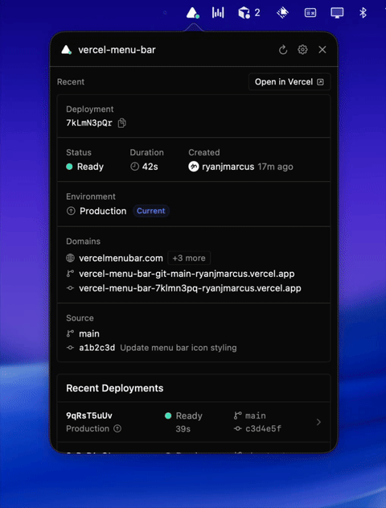

# Vercel Menu Bar

A native macOS menu bar app for monitoring your Vercel deployments.


## Features

- **Live deployment monitoring** - View your recent deployments directly from the menu bar
- **Real-time build status** - See building, ready, error, and cancelled states with live duration counters
- **Quick actions** - Open deployments in Vercel or visit live sites
- **GitHub integration** - Direct links to commits and branches
- **Project selector** - Choose which project to monitor
- **Configurable refresh** - Set polling intervals for normal and active deployment states
- **Automatic updates** - Stay up to date with built-in Sparkle updates

## Screenshots






## Requirements

- macOS 14.0 (Sonoma) or later
- A Vercel account with API access

## Installation

### Download Directly

**[Download Vercel-Menu-Bar-1.2.2.dmg](https://github.com/ryanjmarcus/vercel-menu-bar/releases/download/v1.2.2/Vercel-Menu-Bar-1.2.2.dmg)**

1. Open the DMG and drag the app to Applications
2. Launch from Applications

### Using Homebrew

```bash
brew install --cask vercel-menu-bar
```

### From Source

1. Clone the repository:
   ```bash
   git clone https://github.com/ryanjmarcus/vercel-menu-bar.git
   cd vercel-menu-bar
   ```

2. Open in Xcode:
   ```bash
   open vercel-menu-bar.xcodeproj
   ```

3. Build and run (⌘R)

#### Building for Distribution

To build a distributable DMG:

```bash
./scripts/build.sh
```

This will create both a `.dmg` and `.zip` in the `build/` directory.

### Getting a Vercel API Token

1. Go to [Vercel Account Tokens](https://vercel.com/account/tokens)
2. Click "Create" to generate a new token
3. Copy the token and paste it into the app's Settings

## Usage

1. Click the Vercel icon in your menu bar
2. Go to Settings (gear icon)
3. Paste your Vercel API token
4. Select a project to monitor (optional)
5. Your deployments will appear in the menu

## Architecture

```
vercel-menu-bar/
├── App/                     # App entry point
├── Core/
│   ├── Errors/             # Error types
│   ├── Models/             # Data models
│   └── Services/           # API and settings
├── Features/
│   ├── DeploymentDetail/   # Deployment detail view
│   ├── Main/               # Main menu view
│   ├── MenuBar/            # Menu bar icon
│   └── Settings/           # Settings view
├── Resources/              # Assets
└── Shared/
    ├── Components/         # Reusable UI components
    ├── Extensions/         # Swift extensions
    ├── Icons/              # Custom icons
    └── Theme/              # Colors and typography
```

## Tech Stack

- **SwiftUI** - Modern declarative UI
- **Combine** - Reactive data flow
- **AppKit** - Native macOS integration for menu bar
- **URLSession** - Networking
- **Sparkle** - Automatic updates

## A Note on Development

This app was built with a lot of help from AI — it handled most of the logic and core functionality, while I focused on making the UI feel as close to Vercel's design system as possible.

Testing every possible deployment status, environment type, and edge case has been tricky, so if you run into something that looks off or isn't handled correctly, please open an issue or PR! I'd love the help.

## Contributing

Contributions are welcome! Please feel free to submit a Pull Request.

1. Fork the repository
2. Create your feature branch (`git checkout -b feature/amazing-feature`)
3. Commit your changes (`git commit -m 'Add some amazing feature'`)
4. Push to the branch (`git push origin feature/amazing-feature`)
5. Open a Pull Request

## License

This project is licensed under the MIT License - see the [LICENSE](LICENSE) file for details.

## Acknowledgments

- [Vercel](https://vercel.com) for the excellent deployment platform and API
- [Geist](https://vercel.com/geist) design system for inspiration

---

*Hey Vercel team, if you're reading this — feel free to take it from here.*
